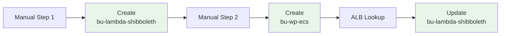
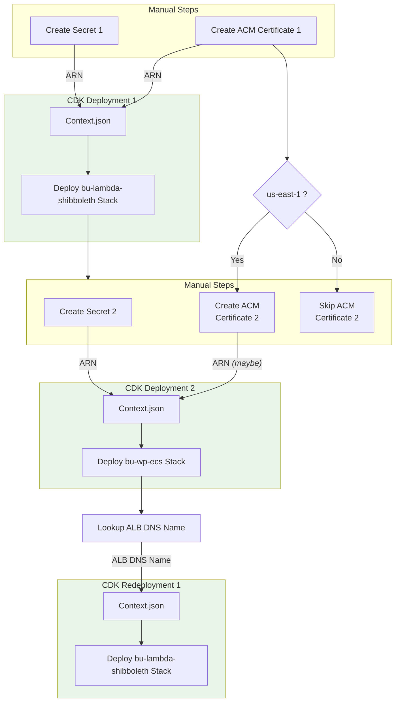

# Deployment Runbook for BU WordPress on ECS
 
This runbook provides step-by-step instructions for deploying this AWS CDK app for BU WordPress on ECS. It outlines the necessary prerequisites, configuration steps, and deployment commands to successfully set up the infrastructure.
 
## Deployment Steps

1. This stack creates an **[ALB Origin](https://docs.aws.amazon.com/AmazonCloudFront/latest/DeveloperGuide/DownloadDistS3AndCustomOrigins.html#concept_elb_origin)**. That is, the anticipated scenario is that the ALB will serve as a target origin for a cloudfront distribution that has already been created in a separate stack. For the Boston Univerity deployment, the companion `bu-lambda-shibboleth` stack that creates this distribution should already be deployed. If that is NOT the case, create that stack before proceeding.

2. Follow the "Prerequisites" steps 1 through 5 in the **[Main Readme File](../README.md)**

3. Follow the "Build Steps" 1 through 6 in the **[Main Readme File](../README.md)**

4. Backup the `./context/context.json` file:

   ```bash
   cp ./context/context.json ./context/context.json.bak
   ```

5. Open the context file located at [`./context/context.json`](./context/context.json). It comes pre-populated with a JSON object comprising example values for most of the necessary parameters for a BU WordPress deployment. Most of the following steps will have you modify or confirm a few of the values of the JSON object.

6. In `./context/context.json`, set the `ACCOUNT` and `REGION` values to the appropriate AWS account and region you will be deploying into. These should match the AWS CLI profile you are using.

7. In `./context/context.json`, set the `TAGS.Landscape` value to the appropriate landscape/environment name you are deploying into. This value will be integrated into the name of the stack and the names of most of the resources created by the stack.

8. You may have a custom domain set up as a hosted zone in Route 53 intended for requests to the cloudfront distribution created by the `bu-lambda-shibboleth` "companion" to this stack. If so, in `./context/context.json`, set the `DNS` properties accordingly:
   - `DNS.hostedZone`: Set this to the Route 53 hosted zone name (e.g., `example.edu`).
   - `DNS.certificateArn`: Set this to the ARN of an existing ACM certificate in the same region where this stack will be deployed (`REGION` in `./context/context.json`) that covers the desired domain/subdomain (e.g., `wp.example.edu`). If the certificate does not exist yet, go to the ACM service in the AWS management console and request it before proceeding, or use the AWS CLI - a full writeup on all of the CLI calls you may need to make for ACM certificate management can be found [here](./docs/acm.md).
   - `DNS.subdomain`: Set this to the combined subdomain and hostedZone for the WordPress site (e.g., `wp.example.edu`). *NOTE: This domain should correspond to a CNAME or alias record in the hosted zone that points to the cloudfront distribution created by the `bu-lambda-shibboleth` stack.*
   - `DNS.cloudfront.distributionDomainName`: Set this to the domain name of the cloudfront distribution created by the `bu-lambda-shibboleth` stack (e.g., `d123abcd.cloudfront.net`). This is needed so that the ALB can whitelist requests coming from the cloudfront distribution. You can find this value in the outputs of the `bu-lambda-shibboleth` stack in the AWS Cloudformation console.

   NOTE: If you do not have a custom domain set up in Route 53, blank out both of these properties as empty strings (`""`).

   NOTE: If you have a custom domain set up in Route 53, but have no matching certificate in ACM, go to the ACM serice in the AWS management console in the region where the ALB will be deployed and request it before proceeding.

9. Secrets Manager:
   - In `./context/context.json`, replace the placeholder value for the `WORDPRESS.secret.wpSecretArn` as per step 6 in the **[Main Readme File](../README.md)**.

   - In `./context/context.json` of the targeted origin stack for WordPress, whether deployed or not, you should make the corresponding change to the `WORDPRESS.secret.spSecretArn` value in its context.json file by setting it to the same ARN value you set for `SHIBBOLETH.secret.secretArn`. 

10. Deploy the stack from scratch with the [CDK deploy command](https://docs.aws.amazon.com/cdk/v2/guide/cli.html#cli-deploy):

   ```
   cdk deploy
   ```

   Alternatively, for preventing stack rollback on error and skipping prompts:

   ```
   npm run deploy
   ```

   ## Deployment Process Flow

The deployment process involves interdependent configuration between the `bu-lambda-shibboleth` and `bu-wp-ecs` stacks. Two separate secrets must be created beforehand, and their ARNs configured in the respective context files. There are 3 separate deployments (2 creations and 1 update) interspersed with manual steps, as illustrated below:

### Basic



### Detailed
The following diagram illustrates the prerequisite setup and 3-step deployment sequence in detail:

