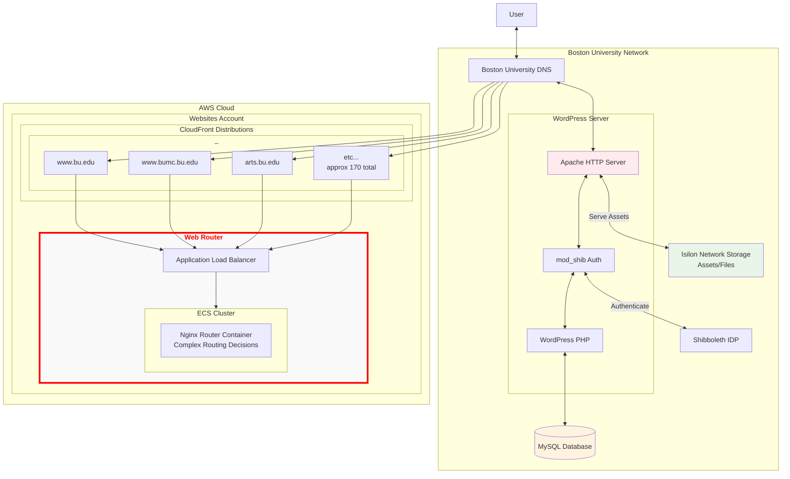

```mermaid
graph TB
    subgraph Boston University Network
        DNS[Boston University DNS]
        
        subgraph WordPress Server
            AP[Apache HTTP Server]
            WP[WordPress PHP]
            SHIB[mod_shib Auth]
        end
        
        DB[(MySQL Database)]
        ISL[Isilon Network Storage<br/>Assets/Files]
        IDP[Shibboleth IDP]
    end

    subgraph AWS Cloud

        subgraph Websites Account
            subgraph CloudFront Distributions
                subgraph _
                    CF1[www.bu.edu]
                    CF2[www.bumc.bu.edu]
                    CF3[arts.bu.edu] 
                    CF4[etc...<br/>approx 170 total]
                end
            end
            
            subgraph RTR[Web Router]
                ALB[Application Load Balancer]
                subgraph ECS[ECS Cluster]
                    NGINX[Nginx Router Container<br/>Complex Routing Decisions]
                end
            end
        end
    end

    USR[User] <--> DNS
    DNS <--> AP
    AP <--> SHIB
    SHIB <-->|Authenticate| IDP
    SHIB <--> WP
    WP <--> DB
    AP <-->|Serve Assets| ISL
    
    DNS --> CF1
    DNS --> CF2
    DNS --> CF3
    DNS --> CF4
    
    CF1 --> ALB
    CF2 --> ALB
    CF3 --> ALB
    CF4 --> ALB

    ALB --> ECS

    style AP fill:#ffebee
    style ISL fill:#e8f5e8
    style DB fill:#fff3e0

    %% Define custom styling for RTR subgraph
    classDef rtrStyle fill:#f9f9f9,stroke:#F00,stroke-width:4px,color:#FF0000,font-weight:bold
    
    %% Apply styling to subgraphs
    class RTR rtrStyle

```