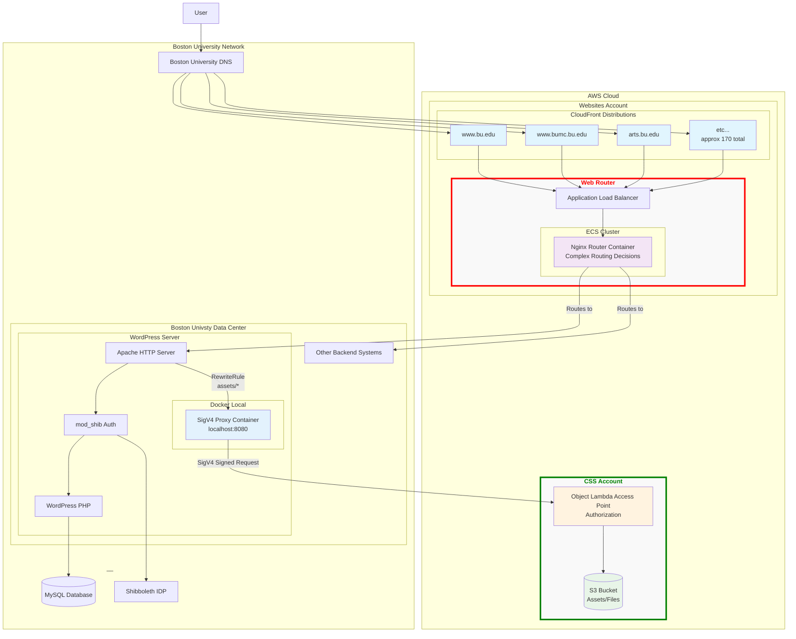

# Phase 1 (completed) - Assets moved to cloud (s3/olap)

```mermaid
graph TB
    USR[User]

    subgraph AWS Cloud
    
        subgraph CSS[CSS Account]
            OL[Object Lambda Access Point<br/>Authorization]
            S3[(S3 Bucket<br/>Assets/Files)]
        end

        subgraph Websites Account
            subgraph CloudFront Distributions
                CF1[www.bu.edu]
                CF2[www.bumc.bu.edu]
                CF3[arts.bu.edu] 
                CF4[etc...<br/>approx 170 total]
            end
            
            subgraph RTR[Web Router]
                ALB[Application Load Balancer]
                subgraph ECS Cluster
                    NGINX[Nginx Router Container<br/>Complex Routing Decisions]
                end
            end
        end
    end

    subgraph Boston University Network
        DNS[Boston University DNS]
        
        subgraph Boston Univsty Data Center
            subgraph WordPress Server
                AP[Apache HTTP Server]
                WP[WordPress PHP]
                SHIB[mod_shib Auth]
                
                subgraph Docker Local
                    PROXY[SigV4 Proxy Container<br/>localhost:8080]
                end
            end
            
            OTHER[Other Backend Systems]
        end
        
        subgraph __
            DB[(MySQL Database)]
            IDP[Shibboleth IDP]
        end
    end

    USR --> DNS
    DNS --> CF1
    DNS --> CF2
    DNS --> CF3
    DNS --> CF4
    
    CF1 --> ALB
    CF2 --> ALB
    CF3 --> ALB
    CF4 --> ALB
    
    ALB --> NGINX
    NGINX -->|Routes to| AP
    NGINX -->|Routes to| OTHER
    
    AP --> SHIB
    SHIB --> IDP
    SHIB --> WP
    WP --> DB
    
    PROXY -->|SigV4 Signed Request| OL
    OL --> S3
    AP -->|RewriteRule<br/>assets/*| PROXY
    
    %% Define custom styling for RTR subgraph
    classDef rtrStyle fill:#f9f9f9,stroke:#F00,stroke-width:4px,color:#FF0000,font-weight:bold
    
    %% Define custom styling for CSS subgraph
    classDef cssStyle fill:#f9f9f9,stroke:#008000,stroke-width:4px,color:#008000,font-weight:bold
    
    %% Apply styling to subgraphs
    class RTR rtrStyle
    class CSS cssStyle
    
    style PROXY fill:#e3f2fd
    style S3 fill:#e8f5e8
    style OL fill:#fff3e0
    style NGINX fill:#f3e5f5
    style CF1 fill:#e1f5fe
    style CF2 fill:#e1f5fe
    style CF3 fill:#e1f5fe
    style CF4 fill:#e1f5fe
    style __ fill:none,stroke:none

```