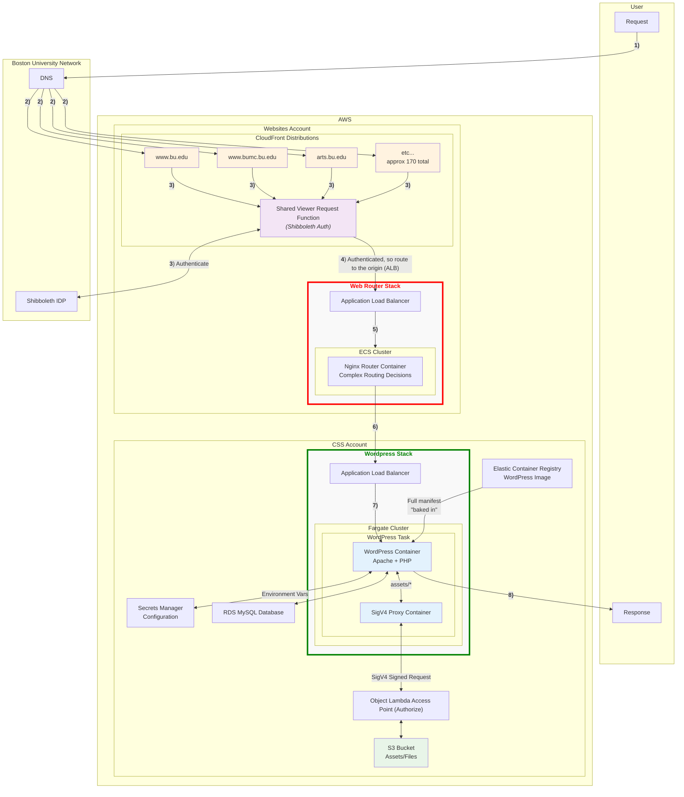

# Phase 2 (proposal 1) - Lambda@Edge shib auth integrated with distributions associated with Web-Router

**Hurdle to this approach:** The shib auth npm package shoule be used in a viewer request edge lambda function, where EVERY request would be processed, despite what's in the cache. However, the 1 MB limit for viewer request lambda code is exceeded by the package, leaving the only choice of origin request lambda with a 50 MB code limit. In order to get the lambda hit for EVERY request, caching is disabled (cache hits bypass going to the origin - hence the lambda would not called).
DISABLING THE CLOUDFRONT DISTRIBUTION CACHE IS NOT AN OPTION FOR A PROD DEPLOYMENT.

