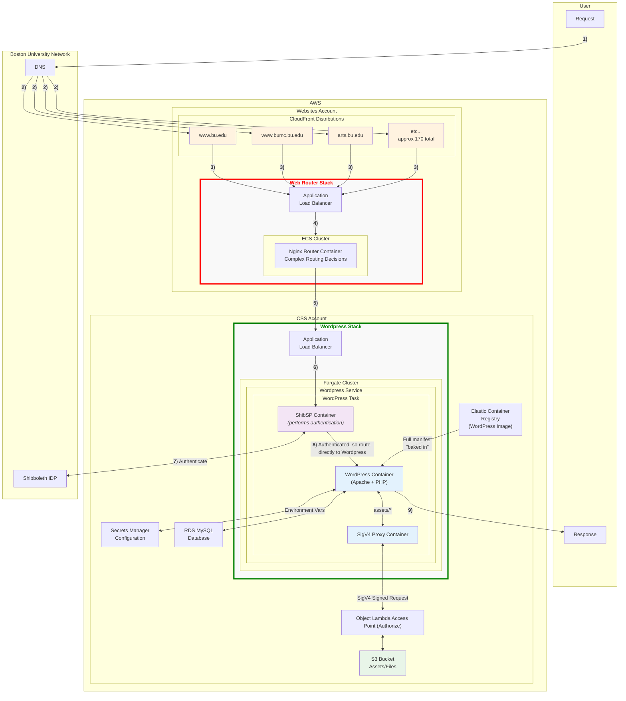

# Phase 2 (proposal 2) - shib auth implemented as another sidecar container in Wordpress ECS task 

This approach as a tentative solution to the problem with Lambda@Edge codebase for shib auth being too big for a Viewer request function being put in an Origin request function, which presents cache problems. To avoid this issue, the shib auth functionality is instead run as another sidecar container within the ECS Wordpress task (Or possibly as another task/service within the Wordpress fargate cluster).

**Drawback of this approach:** If the core shib auth component library is to be carrying out its task in a sidecar container, it has to do so within the context of a listening process based in javascript, like Express.js. While separatation/modularity is preserved, it introduces extra tooling for services that cloudfront@edge will have represented natively if that approach is taken. 

